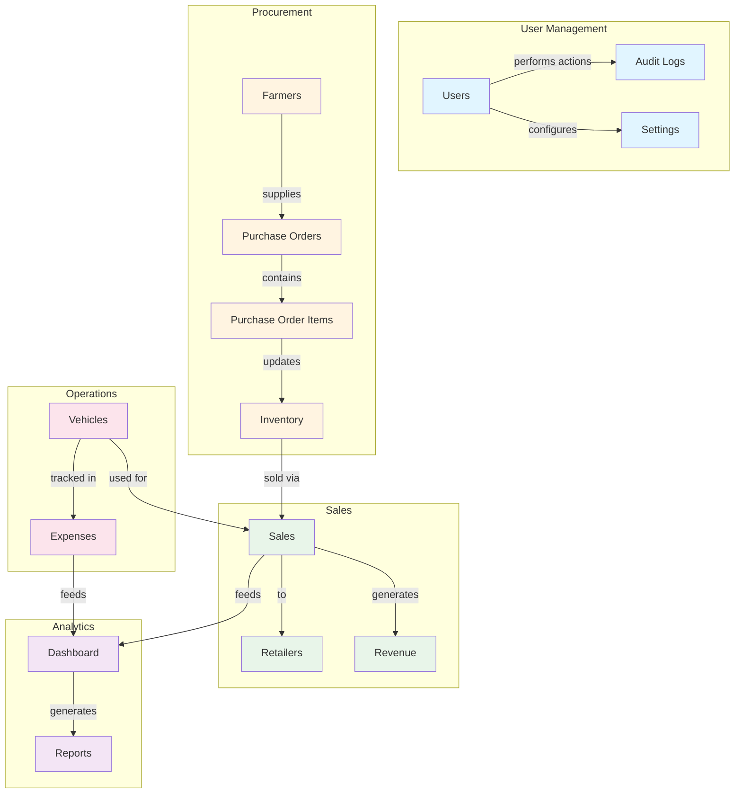
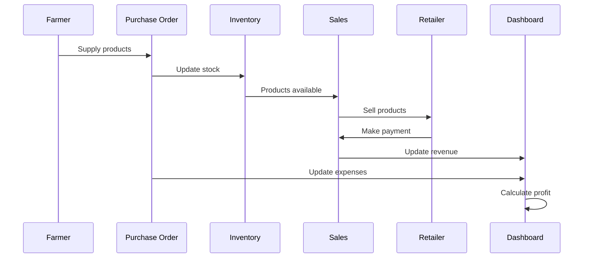
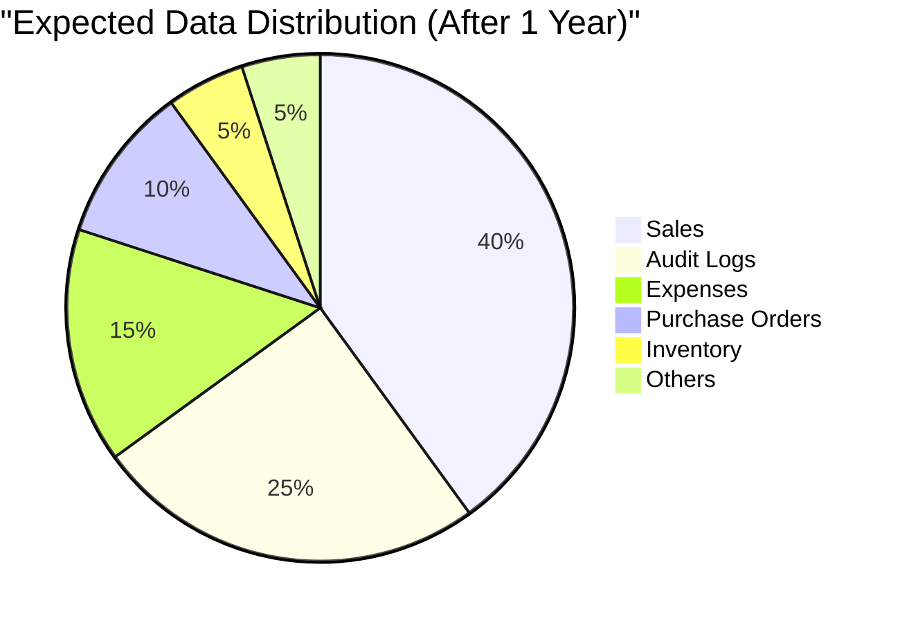
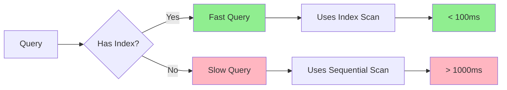
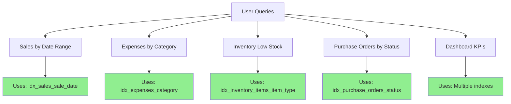
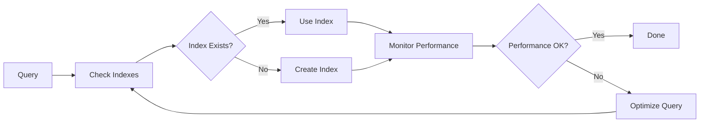
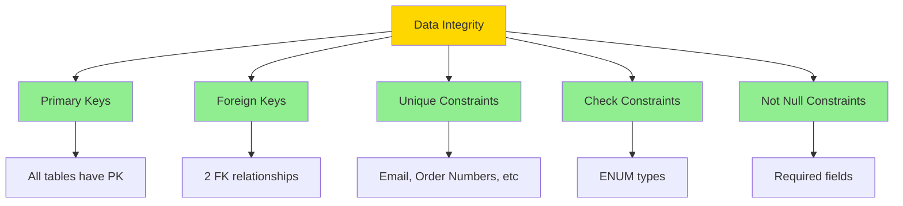
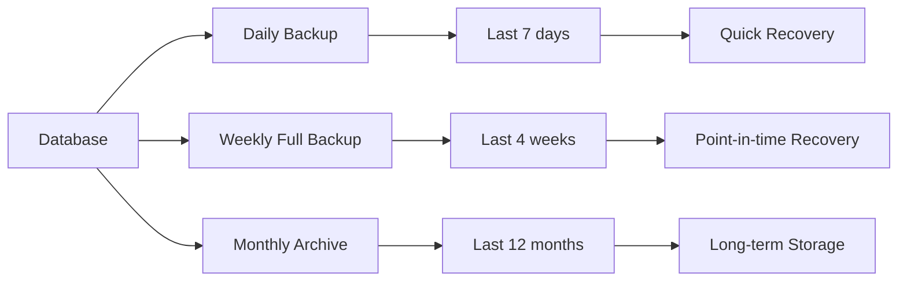

# Database Entity Relationship Diagram

## Complete ERD with All Relationships

```mermaid
erDiagram
    USERS ||--o{ AUDIT_LOGS : "creates"
    RETAILERS ||--o{ SALES : "purchases from"
    PURCHASE_ORDERS ||--|{ PURCHASE_ORDER_ITEMS : "contains"
    SALES }o--|| RETAILERS : "sold to"
    
    USERS {
        bigserial id PK "Primary Key"
        varchar name "User full name"
        citext email UK "Unique email"
        text password_hash "Hashed password"
        user_role role "admin/manager/staff"
        user_status status "active/inactive"
        date join_date "Join date"
        timestamptz last_login "Last login time"
        timestamptz created_at "Created timestamp"
        timestamptz updated_at "Updated timestamp"
    }
    
    VEHICLES {
        bigserial id PK "Primary Key"
        varchar vehicle_number UK "Unique vehicle number"
        varchar vehicle_type "Truck/Van/Pickup"
        varchar driver_name "Driver name"
        varchar phone "Contact phone"
        varchar owner_name "Owner name"
        text address "Owner address"
        decimal total_capacity "Load capacity kg"
        decimal petrol_tank_capacity "Fuel capacity liters"
        decimal mileage "km per liter"
        date join_date "Date added"
        vehicle_status status "active/inactive"
        text note "Additional notes"
        timestamptz created_at "Created timestamp"
        timestamptz updated_at "Updated timestamp"
    }
    
    FARMERS {
        bigserial id PK "Primary Key"
        varchar name "Farmer/Farm name"
        varchar phone "Contact phone"
        varchar email "Contact email"
        text address "Farm address"
        text notes "Additional notes"
        timestamptz created_at "Created timestamp"
        timestamptz updated_at "Updated timestamp"
    }
    
    RETAILERS {
        bigserial id PK "Primary Key"
        varchar name "Shop/Business name"
        varchar owner_name "Owner name"
        varchar phone "Contact phone"
        varchar email "Contact email"
        text address "Shop address"
        text notes "Additional notes"
        timestamptz created_at "Created timestamp"
        timestamptz updated_at "Updated timestamp"
    }
    
    PURCHASE_ORDERS {
        bigserial id PK "Primary Key"
        varchar order_number UK "Unique order number"
        varchar supplier_name "Supplier name"
        date order_date "Order date"
        date due_date "Expected delivery"
        purchase_order_status status "pending/received/cancelled"
        decimal total_amount "Total order value"
        text notes "Additional notes"
        timestamptz created_at "Created timestamp"
        timestamptz updated_at "Updated timestamp"
    }
    
    PURCHASE_ORDER_ITEMS {
        bigserial id PK "Primary Key"
        bigint purchase_order_id FK "Order reference"
        varchar description "Item description"
        decimal quantity "Quantity ordered"
        varchar unit "Unit of measurement"
        decimal unit_cost "Cost per unit"
        decimal line_total "Total line amount"
        timestamptz created_at "Created timestamp"
        timestamptz updated_at "Updated timestamp"
    }
    
    SALES {
        bigserial id PK "Primary Key"
        varchar invoice_number UK "Unique invoice number"
        varchar customer_name "Customer name"
        date sale_date "Sale date"
        product_type product_type "eggs/meat/chicks/other"
        decimal quantity "Quantity sold"
        varchar unit "Unit of measurement"
        decimal unit_price "Price per unit"
        decimal total_amount "Total sale amount"
        payment_status payment_status "paid/pending/partial"
        decimal amount_received "Amount received"
        text notes "Additional notes"
        bigint retailer_id FK "Retailer reference"
        timestamptz created_at "Created timestamp"
        timestamptz updated_at "Updated timestamp"
    }
    
    EXPENSES {
        bigserial id PK "Primary Key"
        date expense_date "Expense date"
        expense_category category "feed/labor/medicine/etc"
        varchar description "Expense description"
        decimal amount "Expense amount"
        payment_method payment_method "cash/bank/check/card"
        text notes "Additional notes"
        timestamptz created_at "Created timestamp"
        timestamptz updated_at "Updated timestamp"
    }
    
    INVENTORY_ITEMS {
        bigserial id PK "Primary Key"
        varchar item_type "Item type/category"
        varchar item_name "Item name"
        decimal quantity "Current quantity"
        varchar unit "Unit of measurement"
        decimal minimum_stock_level "Min stock threshold"
        decimal current_stock_level "Current stock level"
        text notes "Additional notes"
        timestamptz last_updated "Last stock update"
        timestamptz created_at "Created timestamp"
        timestamptz updated_at "Updated timestamp"
    }
    
    SETTINGS {
        bigserial id PK "Primary Key"
        varchar key UK "Unique setting key"
        text value "Setting value"
        varchar category "Setting category"
        text description "Setting description"
        timestamptz created_at "Created timestamp"
        timestamptz updated_at "Updated timestamp"
    }
    
    AUDIT_LOGS {
        bigserial id PK "Primary Key"
        bigint user_id "User reference"
        varchar user_email "User email"
        varchar action "CREATE/UPDATE/DELETE"
        varchar entity "Entity affected"
        varchar entity_id "Entity ID"
        jsonb old_values "Previous values"
        jsonb new_values "New values"
        varchar ip_address "User IP address"
        text user_agent "User browser/client"
        text description "Action description"
        timestamptz created_at "Log timestamp"
    }
```

---

## Data Flow Diagram

---

## Business Process Flow

---

## Table Size and Growth

---

## Index Coverage

---

## Relationship Summary

### Foreign Key Relationships

| Parent Table | Child Table | Relationship | On Delete |
|--------------|-------------|--------------|-----------|
| purchase_orders | purchase_order_items | 1:N | CASCADE |
| retailers | sales | 1:N | SET NULL |

### Implicit Relationships

| Table 1 | Table 2 | Relationship | Type |
|---------|---------|--------------|------|
| users | audit_logs | 1:N | Tracking |
| farmers | purchase_orders | 1:N | Business |
| vehicles | expenses | 1:N | Operations |
| inventory | sales | N:N | Business |

---

## Query Patterns

### Most Common Queries

---

## Performance Optimization

### Index Strategy

---

## Data Integrity

### Constraints

---

## Backup Strategy

---

**Generated**: 2024  
**Database**: PostgreSQL 14+  
**Total Tables**: 11  
**Total Relationships**: 2 FK + Multiple Implicit
