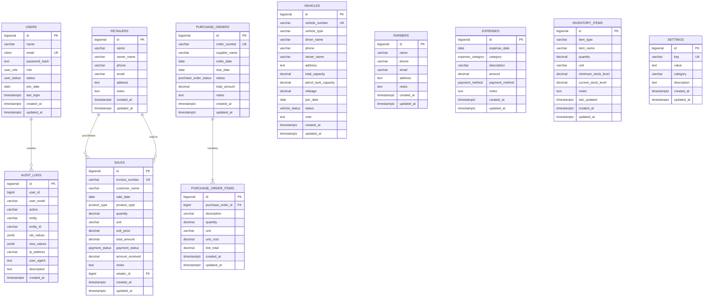

# Database Schema Documentation

## Overview

The Poultry Management System uses PostgreSQL database with 11 main tables to manage all aspects of the poultry business operations.

**Database Name**: `poultry`  
**Total Tables**: 11  
**Custom Types**: 8 ENUM types  
**Indexes**: 30+ for performance optimization

---

## Table of Contents

1. [Data Flow Summary](#data-flow-summary)
2. [Entity Relationship Diagram](#entity-relationship-diagram)
3. [Table Details](#table-details)
4. [Custom Types](#custom-types)
5. [Indexes](#indexes)
6. [Relationships](#relationships)

---

## Data Flow Summary

### Business Process Flow

```
┌─────────────────────────────────────────────────────────────────┐
│                    POULTRY MANAGEMENT SYSTEM                     │
│                         Data Flow Overview                        │
└─────────────────────────────────────────────────────────────────┘

1. PROCUREMENT FLOW
   Farmers → Purchase Orders → Purchase Order Items → Inventory

2. SALES FLOW
   Inventory → Sales → Retailers → Revenue

3. OPERATIONS FLOW
   Vehicles → Deliveries → Expenses → Financial Tracking

4. MANAGEMENT FLOW
   Users → Audit Logs → Settings → System Configuration

5. ANALYTICS FLOW
   Sales + Expenses → Dashboard → Reports → Business Insights
```

### Key Data Relationships

- **Users** authenticate and perform actions tracked in **Audit Logs**
- **Farmers** supply products via **Purchase Orders**
- **Purchase Orders** contain **Purchase Order Items** that update **Inventory**
- **Inventory** items are sold via **Sales** to **Retailers**
- **Vehicles** are used for deliveries and tracked in **Expenses**
- **Expenses** and **Sales** feed into **Dashboard** analytics
- **Settings** control system-wide configuration

---

## Entity Relationship Diagram



---

## Table Details

### 1. USERS Table

**Purpose**: System users with authentication and role-based access control

| Column | Type | Constraints | Description |
|--------|------|-------------|-------------|
| id | BIGSERIAL | PRIMARY KEY | Unique user identifier |
| name | VARCHAR(100) | NOT NULL | User's full name |
| email | CITEXT | UNIQUE, NOT NULL | User's email (case-insensitive) |
| password_hash | TEXT | NOT NULL | Bcrypt hashed password |
| role | user_role | DEFAULT 'manager' | User role (admin/manager/staff) |
| status | user_status | DEFAULT 'active' | Account status (active/inactive) |
| join_date | DATE | DEFAULT CURRENT_DATE | Date user joined |
| last_login | TIMESTAMPTZ | NULL | Last login timestamp |
| created_at | TIMESTAMPTZ | DEFAULT NOW() | Record creation time |
| updated_at | TIMESTAMPTZ | DEFAULT NOW() | Last update time |

**Indexes**:
- `idx_users_email` on email
- `idx_users_role` on role
- `idx_users_status` on status

**Sample Data Count**: 10 users (1 admin, 3 managers, 6 staff)

---

### 2. VEHICLES Table

**Purpose**: Transportation vehicles for deliveries

| Column | Type | Constraints | Description |
|--------|------|-------------|-------------|
| id | BIGSERIAL | PRIMARY KEY | Unique vehicle identifier |
| vehicle_number | VARCHAR(50) | UNIQUE, NOT NULL | Vehicle registration number |
| vehicle_type | VARCHAR(50) | NOT NULL | Type (Truck/Van/Pickup) |
| driver_name | VARCHAR(100) | NOT NULL | Driver's name |
| phone | VARCHAR(20) | NOT NULL | Driver's phone |
| owner_name | VARCHAR(100) | NULL | Vehicle owner name |
| address | TEXT | NULL | Owner's address |
| total_capacity | DECIMAL(10,2) | NULL | Load capacity in kg |
| petrol_tank_capacity | DECIMAL(10,2) | NULL | Fuel tank capacity in liters |
| mileage | DECIMAL(10,2) | NULL | Fuel efficiency km/liter |
| join_date | DATE | DEFAULT CURRENT_DATE | Date vehicle added |
| status | vehicle_status | DEFAULT 'active' | Vehicle status |
| note | TEXT | NULL | Additional notes |
| created_at | TIMESTAMPTZ | DEFAULT NOW() | Record creation time |
| updated_at | TIMESTAMPTZ | DEFAULT NOW() | Last update time |

**Indexes**:
- `idx_vehicles_status` on status
- `idx_vehicles_vehicle_number` on vehicle_number

**Sample Data Count**: 10 vehicles (9 active, 1 inactive)

---

### 3. FARMERS Table

**Purpose**: Farmer suppliers who provide poultry products

| Column | Type | Constraints | Description |
|--------|------|-------------|-------------|
| id | BIGSERIAL | PRIMARY KEY | Unique farmer identifier |
| name | VARCHAR(100) | NOT NULL | Farmer/Farm name |
| phone | VARCHAR(20) | NULL | Contact phone |
| email | VARCHAR(255) | NULL | Contact email |
| address | TEXT | NULL | Farm address |
| notes | TEXT | NULL | Additional notes |
| created_at | TIMESTAMPTZ | DEFAULT NOW() | Record creation time |
| updated_at | TIMESTAMPTZ | DEFAULT NOW() | Last update time |

**Indexes**:
- `idx_farmers_name` on name

**Sample Data Count**: 10 farmers

---

### 4. RETAILERS Table

**Purpose**: Retail customers who purchase products

| Column | Type | Constraints | Description |
|--------|------|-------------|-------------|
| id | BIGSERIAL | PRIMARY KEY | Unique retailer identifier |
| name | VARCHAR(100) | NOT NULL | Shop/Business name |
| owner_name | VARCHAR(100) | NULL | Owner's name |
| phone | VARCHAR(20) | NULL | Contact phone |
| email | VARCHAR(255) | NULL | Contact email |
| address | TEXT | NULL | Shop address |
| notes | TEXT | NULL | Additional notes |
| created_at | TIMESTAMPTZ | DEFAULT NOW() | Record creation time |
| updated_at | TIMESTAMPTZ | DEFAULT NOW() | Last update time |

**Indexes**:
- `idx_retailers_name` on name

**Sample Data Count**: 10 retailers

---

### 5. PURCHASE_ORDERS Table

**Purpose**: Purchase orders from suppliers

| Column | Type | Constraints | Description |
|--------|------|-------------|-------------|
| id | BIGSERIAL | PRIMARY KEY | Unique order identifier |
| order_number | VARCHAR(50) | UNIQUE, NOT NULL | Order reference number |
| supplier_name | VARCHAR(100) | NOT NULL | Supplier name |
| order_date | DATE | NOT NULL | Order placement date |
| due_date | DATE | NULL | Expected delivery date |
| status | purchase_order_status | DEFAULT 'pending' | Order status |
| total_amount | DECIMAL(15,2) | NOT NULL, DEFAULT 0 | Total order value |
| notes | TEXT | NULL | Additional notes |
| created_at | TIMESTAMPTZ | DEFAULT NOW() | Record creation time |
| updated_at | TIMESTAMPTZ | DEFAULT NOW() | Last update time |

**Indexes**:
- `idx_purchase_orders_order_number` on order_number
- `idx_purchase_orders_status` on status
- `idx_purchase_orders_order_date` on order_date

**Sample Data Count**: 10 purchase orders

---

### 6. PURCHASE_ORDER_ITEMS Table

**Purpose**: Line items for purchase orders

| Column | Type | Constraints | Description |
|--------|------|-------------|-------------|
| id | BIGSERIAL | PRIMARY KEY | Unique item identifier |
| purchase_order_id | BIGINT | FK, NOT NULL | Reference to purchase order |
| description | VARCHAR(255) | NOT NULL | Item description |
| quantity | DECIMAL(10,2) | NOT NULL | Quantity ordered |
| unit | VARCHAR(50) | NOT NULL | Unit of measurement |
| unit_cost | DECIMAL(15,2) | NOT NULL | Cost per unit |
| line_total | DECIMAL(15,2) | NOT NULL | Total line amount |
| created_at | TIMESTAMPTZ | DEFAULT NOW() | Record creation time |
| updated_at | TIMESTAMPTZ | DEFAULT NOW() | Last update time |

**Indexes**:
- `idx_purchase_order_items_order_id` on purchase_order_id

**Foreign Keys**:
- `purchase_order_id` → `purchase_orders(id)` ON DELETE CASCADE

**Sample Data Count**: 5+ items

---

### 7. SALES Table

**Purpose**: Sales transactions to customers

| Column | Type | Constraints | Description |
|--------|------|-------------|-------------|
| id | BIGSERIAL | PRIMARY KEY | Unique sale identifier |
| invoice_number | VARCHAR(50) | UNIQUE, NOT NULL | Invoice reference number |
| customer_name | VARCHAR(100) | NOT NULL | Customer name |
| sale_date | DATE | NOT NULL | Sale date |
| product_type | product_type | NOT NULL | Product type (eggs/meat/chicks/other) |
| quantity | DECIMAL(10,2) | NOT NULL | Quantity sold |
| unit | VARCHAR(50) | NULL | Unit of measurement |
| unit_price | DECIMAL(15,2) | NOT NULL | Price per unit |
| total_amount | DECIMAL(15,2) | NOT NULL | Total sale amount |
| payment_status | payment_status | DEFAULT 'pending' | Payment status |
| amount_received | DECIMAL(15,2) | DEFAULT 0 | Amount received |
| notes | TEXT | NULL | Additional notes |
| retailer_id | BIGINT | FK, NULL | Reference to retailer |
| created_at | TIMESTAMPTZ | DEFAULT NOW() | Record creation time |
| updated_at | TIMESTAMPTZ | DEFAULT NOW() | Last update time |

**Indexes**:
- `idx_sales_invoice_number` on invoice_number
- `idx_sales_sale_date` on sale_date
- `idx_sales_product_type` on product_type
- `idx_sales_payment_status` on payment_status
- `idx_sales_retailer_id` on retailer_id

**Foreign Keys**:
- `retailer_id` → `retailers(id)` ON DELETE SET NULL

**Sample Data Count**: 10 sales

---

### 8. EXPENSES Table

**Purpose**: Business expenses tracking

| Column | Type | Constraints | Description |
|--------|------|-------------|-------------|
| id | BIGSERIAL | PRIMARY KEY | Unique expense identifier |
| expense_date | DATE | NOT NULL | Expense date |
| category | expense_category | NOT NULL | Expense category |
| description | VARCHAR(255) | NOT NULL | Expense description |
| amount | DECIMAL(15,2) | NOT NULL | Expense amount |
| payment_method | payment_method | NOT NULL | Payment method used |
| notes | TEXT | NULL | Additional notes |
| created_at | TIMESTAMPTZ | DEFAULT NOW() | Record creation time |
| updated_at | TIMESTAMPTZ | DEFAULT NOW() | Last update time |

**Indexes**:
- `idx_expenses_expense_date` on expense_date
- `idx_expenses_category` on category
- `idx_expenses_payment_method` on payment_method

**Sample Data Count**: 10 expenses

---

### 9. INVENTORY_ITEMS Table

**Purpose**: Inventory stock management

| Column | Type | Constraints | Description |
|--------|------|-------------|-------------|
| id | BIGSERIAL | PRIMARY KEY | Unique item identifier |
| item_type | VARCHAR(50) | NOT NULL | Item type/category |
| item_name | VARCHAR(100) | NOT NULL | Item name |
| quantity | DECIMAL(10,2) | NOT NULL, DEFAULT 0 | Current quantity |
| unit | VARCHAR(50) | NOT NULL | Unit of measurement |
| minimum_stock_level | DECIMAL(10,2) | NOT NULL, DEFAULT 0 | Minimum stock threshold |
| current_stock_level | DECIMAL(10,2) | NOT NULL, DEFAULT 0 | Current stock level |
| notes | TEXT | NULL | Additional notes |
| last_updated | TIMESTAMPTZ | DEFAULT NOW() | Last stock update |
| created_at | TIMESTAMPTZ | DEFAULT NOW() | Record creation time |
| updated_at | TIMESTAMPTZ | DEFAULT NOW() | Last update time |

**Indexes**:
- `idx_inventory_items_item_type` on item_type
- `idx_inventory_items_item_name` on item_name

**Sample Data Count**: 10 items

---

### 10. SETTINGS Table

**Purpose**: System settings and configuration

| Column | Type | Constraints | Description |
|--------|------|-------------|-------------|
| id | BIGSERIAL | PRIMARY KEY | Unique setting identifier |
| key | VARCHAR(100) | UNIQUE, NOT NULL | Setting key |
| value | TEXT | NOT NULL | Setting value |
| category | VARCHAR(50) | NULL | Setting category |
| description | TEXT | NULL | Setting description |
| created_at | TIMESTAMPTZ | DEFAULT NOW() | Record creation time |
| updated_at | TIMESTAMPTZ | DEFAULT NOW() | Last update time |

**Indexes**:
- `idx_settings_key` on key
- `idx_settings_category` on category

**Default Settings**:
- currency: INR
- theme: light
- company_name: Aziz Poultry
- company_email, company_phone, company_address
- tax_rate, low_stock_threshold, date_format, language

**Sample Data Count**: 10 settings

---

### 11. AUDIT_LOGS Table

**Purpose**: Audit trail for all system actions

| Column | Type | Constraints | Description |
|--------|------|-------------|-------------|
| id | BIGSERIAL | PRIMARY KEY | Unique log identifier |
| user_id | BIGINT | NULL | User who performed action |
| user_email | VARCHAR(255) | NULL | User's email |
| action | VARCHAR(50) | NOT NULL | Action performed (CREATE/UPDATE/DELETE) |
| entity | VARCHAR(100) | NOT NULL | Entity affected |
| entity_id | VARCHAR(100) | NULL | ID of affected entity |
| old_values | JSONB | NULL | Previous values (for updates) |
| new_values | JSONB | NULL | New values |
| ip_address | VARCHAR(45) | NULL | User's IP address |
| user_agent | TEXT | NULL | User's browser/client |
| description | TEXT | NULL | Action description |
| created_at | TIMESTAMPTZ | DEFAULT NOW() | Log timestamp |

**Indexes**:
- `idx_audit_logs_user_id` on user_id
- `idx_audit_logs_action` on action
- `idx_audit_logs_entity` on entity
- `idx_audit_logs_entity_id` on entity_id
- `idx_audit_logs_created_at` on created_at DESC
- `idx_audit_logs_user_email` on user_email
- `idx_audit_logs_entity_entity_id` on (entity, entity_id)
- `idx_audit_logs_user_created` on (user_id, created_at DESC)

**Sample Data Count**: Grows with system usage

---

## Custom Types

### 1. user_role
```sql
CREATE TYPE user_role AS ENUM ('admin', 'manager', 'staff');
```
- **admin**: Full system access
- **manager**: Management operations
- **staff**: Limited operations

### 2. user_status
```sql
CREATE TYPE user_status AS ENUM ('active', 'inactive');
```
- **active**: User can login
- **inactive**: User cannot login

### 3. vehicle_status
```sql
CREATE TYPE vehicle_status AS ENUM ('active', 'inactive');
```
- **active**: Vehicle in service
- **inactive**: Vehicle not available

### 4. purchase_order_status
```sql
CREATE TYPE purchase_order_status AS ENUM ('pending', 'received', 'cancelled');
```
- **pending**: Order placed, awaiting delivery
- **received**: Order delivered
- **cancelled**: Order cancelled

### 5. product_type
```sql
CREATE TYPE product_type AS ENUM ('eggs', 'meat', 'chicks', 'other');
```
Product categories for sales

### 6. payment_status
```sql
CREATE TYPE payment_status AS ENUM ('paid', 'pending', 'partial');
```
- **paid**: Fully paid
- **pending**: Payment due
- **partial**: Partially paid

### 7. expense_category
```sql
CREATE TYPE expense_category AS ENUM (
  'feed', 'labor', 'medicine', 'utilities', 
  'equipment', 'maintenance', 'transportation', 'other'
);
```
Expense classification categories

### 8. payment_method
```sql
CREATE TYPE payment_method AS ENUM (
  'cash', 'bank_transfer', 'check', 'credit_card'
);
```
Payment methods used

---

## Indexes

Total indexes: 30+

### Performance Optimization
- All foreign keys have indexes
- Date columns used in queries have indexes
- Status/category columns have indexes
- Unique constraints automatically create indexes

### Query Optimization
- Composite indexes for common query patterns
- Descending indexes for recent-first queries
- JSONB indexes for audit log searches

---

## Relationships

### One-to-Many Relationships

1. **purchase_orders → purchase_order_items**
   - One purchase order has many items
   - CASCADE delete: Deleting order deletes items

2. **retailers → sales**
   - One retailer has many sales
   - SET NULL delete: Deleting retailer keeps sales

3. **users → audit_logs** (implicit)
   - One user creates many audit logs
   - No foreign key constraint (for data retention)

### Data Flow Relationships

```
Farmers → Purchase Orders → Inventory → Sales → Retailers
                ↓                          ↓
         Purchase Order Items         Revenue
                                           ↓
Vehicles → Expenses ← Operations    Dashboard Analytics
```

---

## Database Statistics

### Expected Record Counts (After Seeding)

| Table | Records | Growth Rate |
|-------|---------|-------------|
| users | 10 | Low (manual) |
| vehicles | 10 | Low (manual) |
| farmers | 10 | Low (manual) |
| retailers | 10 | Low (manual) |
| purchase_orders | 10+ | Medium (monthly) |
| purchase_order_items | 20+ | Medium (per order) |
| sales | 10+ | High (daily) |
| expenses | 10+ | Medium (weekly) |
| inventory_items | 10+ | Low (manual) |
| settings | 10 | Very Low (manual) |
| audit_logs | 0+ | High (automatic) |

### Storage Estimates

- Small deployment: < 100 MB
- Medium deployment: 100 MB - 1 GB
- Large deployment: > 1 GB

---

## Maintenance

### Regular Tasks

1. **Daily**
   - Monitor audit logs
   - Check inventory levels

2. **Weekly**
   - Review sales and expenses
   - Update inventory

3. **Monthly**
   - Archive old audit logs
   - Backup database
   - Analyze performance

### Backup Strategy

```bash
# Full backup
pg_dump -U postgres poultry > backup_$(date +%Y%m%d).sql

# Schema only
pg_dump -U postgres --schema-only poultry > schema.sql

# Data only
pg_dump -U postgres --data-only poultry > data.sql
```

---

## Migration Files

All SQL files are located in `BackEnd/migrations/`:

1. `000_master_setup.sql` - Complete schema setup
2. `004_create_inventory_table.sql` - Inventory table
3. `008_create_settings_table.sql` - Settings table
4. `009_create_audit_logs_table.sql` - Audit logs table
5. `010_seed_data.sql` - Sample data (checks existing data first)
6. `check-existing-data.sql` - Check current data

---

## Usage

### Check Existing Data
```bash
psql -U postgres -d poultry -f migrations/check-existing-data.sql
```

### Seed Data (Safe - Checks First)
```bash
psql -U postgres -d poultry -f migrations/010_seed_data.sql
```

### Full Setup
```bash
psql -U postgres -d poultry -f migrations/000_master_setup.sql
psql -U postgres -d poultry -f migrations/010_seed_data.sql
```

---

**Last Updated**: 2024  
**Database Version**: PostgreSQL 14+  
**Schema Version**: 1.0
