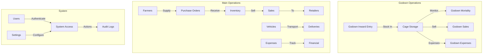

# Complete Database Diagram - Poultry Management System

## Full Entity Relationship Diagram

```mermaid
erDiagram
    %% Relationships
    PURCHASE_ORDERS ||--|{ PURCHASE_ORDER_ITEMS : contains
    RETAILERS ||--o{ SALES : "sold to"
    
    %% Core System Tables
    USERS {
        bigint id PK
        varchar name
        citext email UK
        text password_hash
        user_role role
        user_status status
        date join_date
        timestamptz last_login
        timestamptz created_at
        timestamptz updated_at
    }
    
    AUDIT_LOGS {
        bigint id PK
        bigint user_id
        varchar user_email
        varchar action
        varchar entity
        varchar entity_id
        jsonb old_values
        jsonb new_values
        varchar ip_address
        text user_agent
        text description
        timestamptz created_at
    }
    
    SETTINGS {
        text key PK
        text value
        varchar category
        text description
        timestamptz updated_at
    }
    
    %% Master Data Tables
    FARMERS {
        bigint id PK
        varchar name
        varchar phone
        varchar email
        text address
        varchar status
        text notes
        timestamptz created_at
        timestamptz updated_at
    }
    
    RETAILERS {
        bigint id PK
        varchar name
        varchar owner_name
        varchar phone
        varchar email
        text address
        varchar status
        text notes
        timestamptz created_at
        timestamptz updated_at
    }
    
    VEHICLES {
        bigint id PK
        varchar vehicle_number UK
        varchar vehicle_type
        varchar driver_name
        varchar phone
        varchar owner_name
        text address
        integer total_capacity
        numeric petrol_tank_capacity
        numeric mileage
        date join_date
        vehicle_status_type status
        text note
        timestamptz created_at
        timestamptz updated_at
    }
    
    %% Purchase Management
    PURCHASE_ORDERS {
        bigint id PK
        varchar order_number UK
        varchar supplier_name
        date order_date
        date due_date
        purchase_status status
        numeric total_amount
        text notes
        timestamptz created_at
        timestamptz updated_at
    }
    
    PURCHASE_ORDER_ITEMS {
        bigint id PK
        bigint purchase_order_id FK
        text description
        numeric quantity
        varchar unit
        numeric unit_cost
        numeric line_total
    }
    
    %% Sales Management
    SALES {
        bigint id PK
        varchar invoice_number UK
        varchar customer_name
        date sale_date
        sale_product_type product_type
        numeric quantity
        varchar unit
        numeric unit_price
        numeric total_amount
        payment_status_type payment_status
        numeric amount_received
        text notes
        bigint retailer_id FK
        timestamptz created_at
        timestamptz updated_at
    }
    
    %% Inventory Management
    INVENTORY_ITEMS {
        integer id PK
        varchar item_type
        varchar item_name
        numeric quantity
        varchar unit
        numeric minimum_stock_level
        numeric current_stock_level
        text notes
        timestamp last_updated
        timestamp created_at
        timestamp updated_at
    }
    
    %% Financial Management
    EXPENSES {
        bigint id PK
        date expense_date
        expense_category_type category
        text description
        numeric amount
        payment_method_type payment_method
        text notes
        timestamptz created_at
        timestamptz updated_at
    }
    
    %% Godown Management
    GODOWN_INWARD_ENTRIES {
        bigint id PK
        date entry_date
        varchar reference_no
        varchar source
        varchar cage_id
        integer number_of_birds
        numeric weight_kg
        numeric rate_per_kg
        numeric amount
        text notes
        timestamptz created_at
        timestamptz updated_at
    }
    
    GODOWN_MORTALITY {
        bigint id PK
        date date
        varchar reference_no
        varchar cage_id
        integer number_of_birds_died
        varchar cause
        text notes
        timestamptz created_at
        timestamptz updated_at
    }
    
    GODOWN_EXPENSES {
        bigint id PK
        date date
        expense_category_type category
        varchar description
        numeric amount
        payment_method_type payment_method
        text notes
        timestamptz created_at
        timestamptz updated_at
    }
    
    GODOWN_SALES {
        bigint id PK
        date sale_date
        varchar invoice_no UK
        varchar customer_name
        varchar cage_id
        integer number_of_birds
        numeric rate_per_kg
        numeric amount
        text notes
        timestamptz created_at
        timestamptz updated_at
    }
```

---

## Database Statistics

### Total Tables: 15

| Category | Tables | Count |
|----------|--------|-------|
| Core System | users, settings, audit_logs | 3 |
| Master Data | farmers, retailers, vehicles | 3 |
| Purchase Management | purchase_orders, purchase_order_items | 2 |
| Sales Management | sales | 1 |
| Inventory | inventory_items | 1 |
| Financial | expenses | 1 |
| Godown Operations | godown_inward_entries, godown_mortality, godown_expenses, godown_sales | 4 |

### Custom Types (ENUMs): 8

1. **user_role**: admin, manager, staff
2. **user_status**: active, inactive
3. **vehicle_status_type**: active, inactive
4. **purchase_status**: pending, received, cancelled
5. **sale_product_type**: eggs, meat, chicks, other
6. **payment_status_type**: paid, pending, partial
7. **expense_category_type**: feed, labor, medicine, utilities, equipment, maintenance, transportation, other
8. **payment_method_type**: cash, bank_transfer, check, credit_card

---

## Table Relationships

### Foreign Key Relationships

1. **purchase_order_items.purchase_order_id** → **purchase_orders.id**
   - One purchase order has many items
   - CASCADE delete

2. **sales.retailer_id** → **retailers.id**
   - One retailer has many sales
   - SET NULL delete

### Logical Relationships (No FK)

- **Godown tables** linked by `cage_id` field
- **Farmers** → **Purchase Orders** (by supplier_name)
- **Vehicles** → **Expenses** (by transportation category)

---

## Data Flow

---

## Key Features

### Security
- Password hashing for users
- Role-based access control (admin, manager, staff)
- Audit logging for all actions
- Case-insensitive email (citext)

### Data Integrity
- Foreign key constraints
- Unique constraints on key fields
- NOT NULL constraints on required fields
- Default values for status fields

### Performance
- Indexes on frequently queried columns
- Indexes on foreign keys
- Indexes on date columns
- Indexes on status/category columns

### Flexibility
- JSONB for audit log values
- Text fields for notes
- ENUM types for controlled values
- Nullable fields for optional data

---

**Generated:** 2024  
**Database:** PostgreSQL 14+  
**Total Tables:** 15  
**Total Custom Types:** 8  
**Source:** Render PostgreSQL Database
